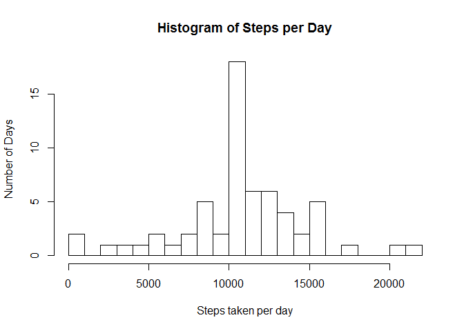
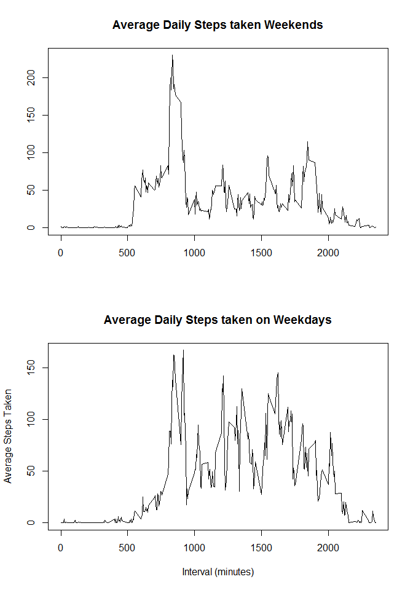

# Reproducible Research: Peer Assessment 1


## Loading and preprocessing the data  

This analysis assumes activity.zip is in the working directory, then unzips it to the directory ./activity if not already present.


```r
if(!file.exists("./activity/activity.csv")) {
  unzip("./activity.zip", exdir = "./activity")
} # Unzip the contents of activity.zip to ./activity if not already present.

activity <- read.csv("activity/activity.csv", header=TRUE, stringsAsFactors=FALSE)
```
The steps are then grouped by day:


```r
byday <- aggregate(activity$steps, by=list(Category=activity$date),
                   FUN=sum)
names(byday) <- c("date", "steps")
```

## What is mean total number of steps taken per day?

Below is a histogram of steps taken per day, which displays a slightly skewed left distribution. The mean and median are also calculated.


```r
hist(byday$steps, breaks=20, xlab="Steps taken per day",
     ylab="Number of Days",
     main = "Histogram of Steps per Day")
```

<!-- -->

```r
mean(byday$steps, na.rm=TRUE)
```

```
## [1] 10766.19
```

```r
median(byday$steps, na.rm=TRUE)
```

```
## [1] 10765
```
The data appears to have normalized further after imputing missing values, bringing the mean closer to the median and making the shape of the distribution more symmetric.

## What is the average daily activity pattern?

Now the steps are averaged by interval over every day the data was collected, so e.g. the number of steps occurring in interval 5 gets averaged over every day from 2012-10-01 to 2012-11-30. This is then graphed in a time-series plot.


```r
byinterval <- aggregate(activity$steps, by=list(Category=activity$interval), FUN=mean, na.rm=TRUE)
names(byinterval) <- c("interval", "steps")
plot(byinterval$interval, byinterval$steps, type="l",
     xlab="Interval (minutes)", ylab="Average Steps Taken",
     main="Average Daily Steps taken vs Interval")
```

<!-- -->


## Imputing missing values

Here the number of NA values in the data are calculated and reported.


```r
NAindices <- is.na(activity$steps)
n <- length(activity$steps[NAindices])
n
```

```
## [1] 2304
```
Any intervals with NA values are replaced by the mean of that interval over all the days. Then a new histogram is plotted with this new dataset.


```r
for(i in 1:n){ # This loop steps through all NA values in data,
  j <- activity[NAindices,3][i] # then replaces values with mean
  activity[NAindices,1][i] <-   # steps of each interval.
    byinterval[byinterval$interval==j,2]
} # Add up steps taken on the days of the new dataset. Then create historgram.
byday <- aggregate(activity$steps, by=list(Category=activity$date),
                   FUN=sum)
names(byday) <- c("date", "steps")
hist(byday$steps, breaks=20, xlab="Steps taken per day", ylab="Number of Days",
     main = "Histogram of Steps per Day")
```

<!-- -->

```r
mean(byday$steps, na.rm=TRUE)
```

```
## [1] 10766.19
```

```r
median(byday$steps, na.rm=TRUE)
```

```
## [1] 10766.19
```

## Are there differences in activity patterns between weekdays and weekends?

Here the date column in the activity dataframe is converted to weekdays:


```r
dates <- as.Date(activity$date)
week_days <- c('Monday', 'Tuesday', 'Wednesday', 'Thursday', 'Friday')
activity$days <- factor((weekdays(dates) %in% week_days),
                        levels=c(TRUE, FALSE),
                        labels=c('weekend','weekday'))
```
Lastly the average number of steps taken are plotted against whether the data was collected on a weekday or a weekend:


```r
par(mfrow=c(2,1)) # First plot average steps over weekends.
byinterval <- with(subset(activity, days %in% 'weekend'),
                   aggregate(steps,
                             by=list(Category=interval),
                             FUN=mean, na.rm=TRUE))
names(byinterval) <- c("interval", "steps")
plot(byinterval$interval, byinterval$steps, type="l",
     xlab="", ylab="",
     main="Average Daily Steps taken Weekends")

# Then plot average steps over weekdays.
byinterval <- with(subset(activity, days %in% 'weekday'),
                   aggregate(steps,
                             by=list(Category=interval),
                             FUN=mean, na.rm=TRUE))
names(byinterval) <- c("interval", "steps")
plot(byinterval$interval, byinterval$steps, type="l",
     xlab="Interval (minutes)", ylab="Average Steps Taken",
     main="Average Daily Steps taken on Weekdays")
```

<!-- -->
There is a noticeable trend of an increase in the average number of steps taken on weekdays compared to weekends.
